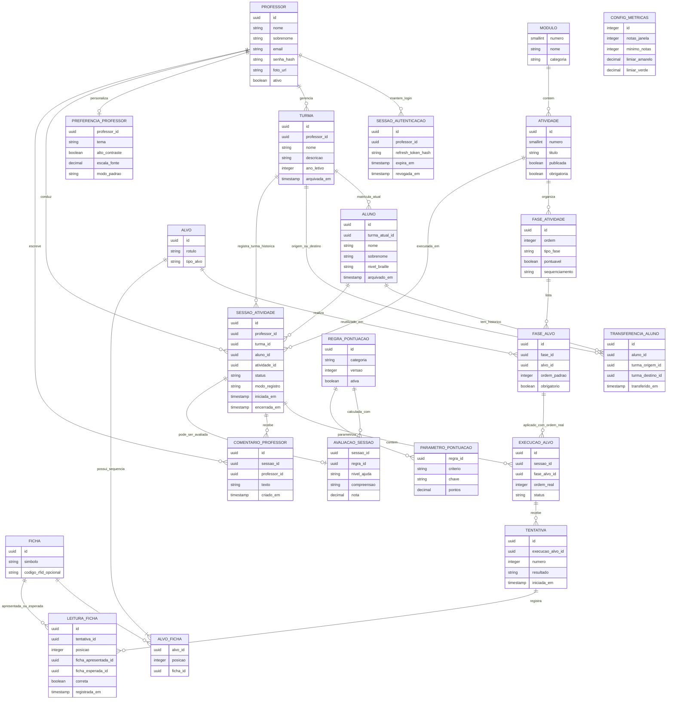
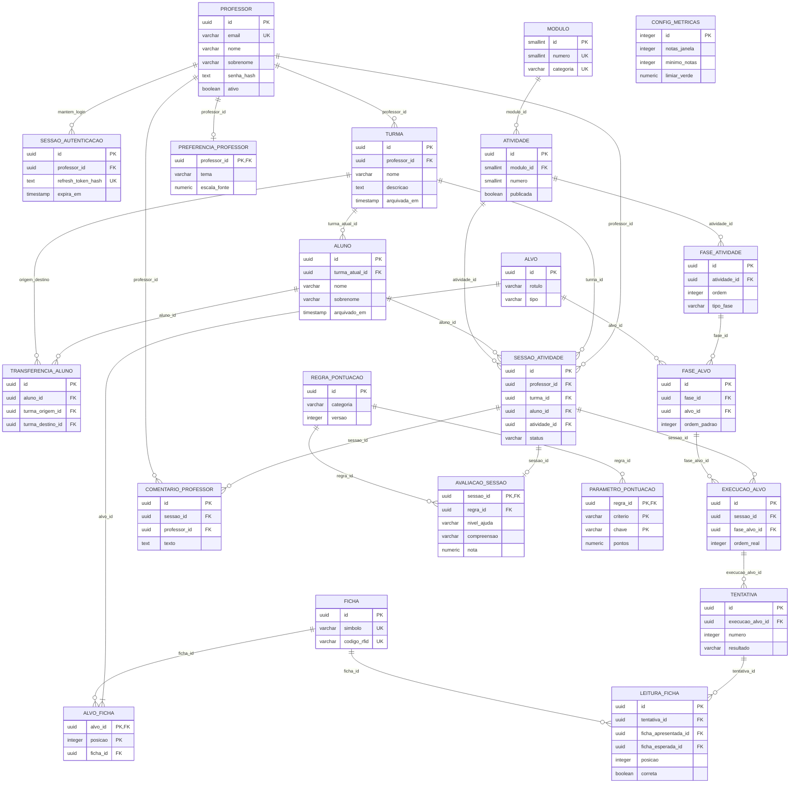

# DTAE — Diagramas Mermaid (copiar e colar)

## Modelo Entidade-Relacionamento

```mermaid
erDiagram
    %% DTAE — Modelo Entidade-Relacionamento conceitual (MVP)
    %% Cada atividade tem fases, que apresentam alvos reutilizaveis.
    %% Um alvo pode exigir uma ou mais fichas em ordem.

    PROFESSOR ||--o{ SESSAO_AUTENTICACAO : mantem_login
    PROFESSOR ||--o{ TURMA : gerencia
    PROFESSOR ||--o| PREFERENCIA_PROFESSOR : personaliza
    TURMA ||--o{ ALUNO : matricula_atual
    ALUNO ||--o{ TRANSFERENCIA_ALUNO : tem_historico
    TURMA ||--o{ TRANSFERENCIA_ALUNO : origem_ou_destino

    MODULO ||--o{ ATIVIDADE : contem
    ATIVIDADE ||--o{ FASE_ATIVIDADE : organiza
    FASE_ATIVIDADE ||--o{ FASE_ALVO : lista
    ALVO ||--o{ FASE_ALVO : reutilizado_em
    ALVO ||--|{ ALVO_FICHA : possui_sequencia
    FICHA ||--o{ ALVO_FICHA : ficha_esperada

    PROFESSOR ||--o{ SESSAO_ATIVIDADE : conduz
    TURMA ||--o{ SESSAO_ATIVIDADE : registra_turma_historica
    ALUNO ||--o{ SESSAO_ATIVIDADE : realiza
    ATIVIDADE ||--o{ SESSAO_ATIVIDADE : executada_em
    SESSAO_ATIVIDADE ||--o{ EXECUCAO_ALVO : contem
    FASE_ALVO ||--o{ EXECUCAO_ALVO : aplicado_com_ordem_real
    EXECUCAO_ALVO ||--o{ TENTATIVA : recebe
    TENTATIVA ||--o{ LEITURA_FICHA : registra
    FICHA ||--o{ LEITURA_FICHA : apresentada_ou_esperada

    PROFESSOR ||--o{ COMENTARIO_PROFESSOR : escreve
    SESSAO_ATIVIDADE ||--o{ COMENTARIO_PROFESSOR : recebe
    SESSAO_ATIVIDADE ||--o| AVALIACAO_SESSAO : pode_ser_avaliada
    REGRA_PONTUACAO ||--o{ AVALIACAO_SESSAO : calculada_com
    REGRA_PONTUACAO ||--o{ PARAMETRO_PONTUACAO : parametriza

    PROFESSOR {
        uuid id
        string nome
        string sobrenome
        string email
        string senha_hash
        string foto_url
        boolean ativo
    }
    SESSAO_AUTENTICACAO {
        uuid id
        uuid professor_id
        string refresh_token_hash
        timestamp expira_em
        timestamp revogada_em
    }
    PREFERENCIA_PROFESSOR {
        uuid professor_id
        string tema
        boolean alto_contraste
        decimal escala_fonte
        string modo_padrao
    }
    TURMA {
        uuid id
        uuid professor_id
        string nome
        string descricao
        integer ano_letivo
        timestamp arquivada_em
    }
    ALUNO {
        uuid id
        uuid turma_atual_id
        string nome
        string sobrenome
        string nivel_braille
        timestamp arquivado_em
    }
    TRANSFERENCIA_ALUNO {
        uuid id
        uuid aluno_id
        uuid turma_origem_id
        uuid turma_destino_id
        timestamp transferido_em
    }
    MODULO {
        smallint numero
        string nome
        string categoria
    }
    ATIVIDADE {
        uuid id
        smallint numero
        string titulo
        boolean publicada
        boolean obrigatoria
    }
    FASE_ATIVIDADE {
        uuid id
        integer ordem
        string tipo_fase
        boolean pontuavel
        string sequenciamento
    }
    ALVO {
        uuid id
        string rotulo
        string tipo_alvo
    }
    FICHA {
        uuid id
        string simbolo
        string codigo_rfid_opcional
    }
    ALVO_FICHA {
        uuid alvo_id
        integer posicao
        uuid ficha_id
    }
    FASE_ALVO {
        uuid id
        uuid fase_id
        uuid alvo_id
        integer ordem_padrao
        boolean obrigatorio
    }
    SESSAO_ATIVIDADE {
        uuid id
        uuid professor_id
        uuid turma_id
        uuid aluno_id
        uuid atividade_id
        string status
        string modo_registro
        timestamp iniciada_em
        timestamp encerrada_em
    }
    EXECUCAO_ALVO {
        uuid id
        uuid sessao_id
        uuid fase_alvo_id
        integer ordem_real
        string status
    }
    TENTATIVA {
        uuid id
        uuid execucao_alvo_id
        integer numero
        string resultado
        timestamp iniciada_em
    }
    LEITURA_FICHA {
        uuid id
        uuid tentativa_id
        integer posicao
        uuid ficha_apresentada_id
        uuid ficha_esperada_id
        boolean correta
        timestamp registrada_em
    }
    COMENTARIO_PROFESSOR {
        uuid id
        uuid sessao_id
        uuid professor_id
        string texto
        timestamp criado_em
    }
    AVALIACAO_SESSAO {
        uuid sessao_id
        uuid regra_id
        string nivel_ajuda
        string compreensao
        decimal nota
    }
    REGRA_PONTUACAO {
        uuid id
        string categoria
        integer versao
        boolean ativa
    }
    PARAMETRO_PONTUACAO {
        uuid regra_id
        string criterio
        string chave
        decimal pontos
    }
    CONFIG_METRICAS {
        integer id
        integer notas_janela
        integer minimo_notas
        decimal limiar_amarelo
        decimal limiar_verde
    }

```

## Modelo Relacional

```mermaid
erDiagram
    PROFESSOR ||--o{ SESSAO_AUTENTICACAO : mantem_login
    PROFESSOR ||--o{ TURMA : professor_id
    PROFESSOR ||--o| PREFERENCIA_PROFESSOR : professor_id
    TURMA ||--o{ ALUNO : turma_atual_id
    ALUNO ||--o{ TRANSFERENCIA_ALUNO : aluno_id
    TURMA ||--o{ TRANSFERENCIA_ALUNO : origem_destino
    MODULO ||--o{ ATIVIDADE : modulo_id
    ATIVIDADE ||--o{ FASE_ATIVIDADE : atividade_id
    FASE_ATIVIDADE ||--o{ FASE_ALVO : fase_id
    ALVO ||--o{ FASE_ALVO : alvo_id
    ALVO ||--|{ ALVO_FICHA : alvo_id
    FICHA ||--o{ ALVO_FICHA : ficha_id
    PROFESSOR ||--o{ SESSAO_ATIVIDADE : professor_id
    TURMA ||--o{ SESSAO_ATIVIDADE : turma_id
    ALUNO ||--o{ SESSAO_ATIVIDADE : aluno_id
    ATIVIDADE ||--o{ SESSAO_ATIVIDADE : atividade_id
    SESSAO_ATIVIDADE ||--o{ EXECUCAO_ALVO : sessao_id
    FASE_ALVO ||--o{ EXECUCAO_ALVO : fase_alvo_id
    EXECUCAO_ALVO ||--o{ TENTATIVA : execucao_alvo_id
    TENTATIVA ||--o{ LEITURA_FICHA : tentativa_id
    FICHA ||--o{ LEITURA_FICHA : ficha_id
    SESSAO_ATIVIDADE ||--o{ COMENTARIO_PROFESSOR : sessao_id
    PROFESSOR ||--o{ COMENTARIO_PROFESSOR : professor_id
    SESSAO_ATIVIDADE ||--o| AVALIACAO_SESSAO : sessao_id
    REGRA_PONTUACAO ||--o{ AVALIACAO_SESSAO : regra_id
    REGRA_PONTUACAO ||--o{ PARAMETRO_PONTUACAO : regra_id

    PROFESSOR {
        uuid id PK
        varchar email UK
        varchar nome
        varchar sobrenome
        text senha_hash
        boolean ativo
    }
    SESSAO_AUTENTICACAO {
        uuid id PK
        uuid professor_id FK
        text refresh_token_hash UK
        timestamp expira_em
    }
    PREFERENCIA_PROFESSOR {
        uuid professor_id PK, FK
        varchar tema
        numeric escala_fonte
    }
    TURMA {
        uuid id PK
        uuid professor_id FK
        varchar nome
        text descricao
        timestamp arquivada_em
    }
    ALUNO {
        uuid id PK
        uuid turma_atual_id FK
        varchar nome
        varchar sobrenome
        timestamp arquivado_em
    }
    TRANSFERENCIA_ALUNO {
        uuid id PK
        uuid aluno_id FK
        uuid turma_origem_id FK
        uuid turma_destino_id FK
    }
    MODULO {
        smallint id PK
        smallint numero UK
        varchar categoria UK
    }
    ATIVIDADE {
        uuid id PK
        smallint modulo_id FK
        smallint numero
        boolean publicada
    }
    FASE_ATIVIDADE {
        uuid id PK
        uuid atividade_id FK
        integer ordem
        varchar tipo_fase
    }
    FASE_ALVO {
        uuid id PK
        uuid fase_id FK
        uuid alvo_id FK
        integer ordem_padrao
    }
    ALVO {
        uuid id PK
        varchar rotulo
        varchar tipo
    }
    FICHA {
        uuid id PK
        varchar simbolo UK
        varchar codigo_rfid UK
    }
    ALVO_FICHA {
        uuid alvo_id PK, FK
        integer posicao PK
        uuid ficha_id FK
    }
    SESSAO_ATIVIDADE {
        uuid id PK
        uuid professor_id FK
        uuid turma_id FK
        uuid aluno_id FK
        uuid atividade_id FK
        varchar status
    }
    EXECUCAO_ALVO {
        uuid id PK
        uuid sessao_id FK
        uuid fase_alvo_id FK
        integer ordem_real
    }
    TENTATIVA {
        uuid id PK
        uuid execucao_alvo_id FK
        integer numero
        varchar resultado
    }
    LEITURA_FICHA {
        uuid id PK
        uuid tentativa_id FK
        uuid ficha_apresentada_id FK
        uuid ficha_esperada_id FK
        integer posicao
        boolean correta
    }
    COMENTARIO_PROFESSOR {
        uuid id PK
        uuid sessao_id FK
        uuid professor_id FK
        text texto
    }
    REGRA_PONTUACAO {
        uuid id PK
        varchar categoria
        integer versao
    }
    PARAMETRO_PONTUACAO {
        uuid regra_id PK, FK
        varchar criterio PK
        varchar chave PK
        numeric pontos
    }
    AVALIACAO_SESSAO {
        uuid sessao_id PK, FK
        uuid regra_id FK
        varchar nivel_ajuda
        varchar compreensao
        numeric nota
    }
    CONFIG_METRICAS {
        integer id PK
        integer notas_janela
        integer minimo_notas
        numeric limiar_verde
    }

```
